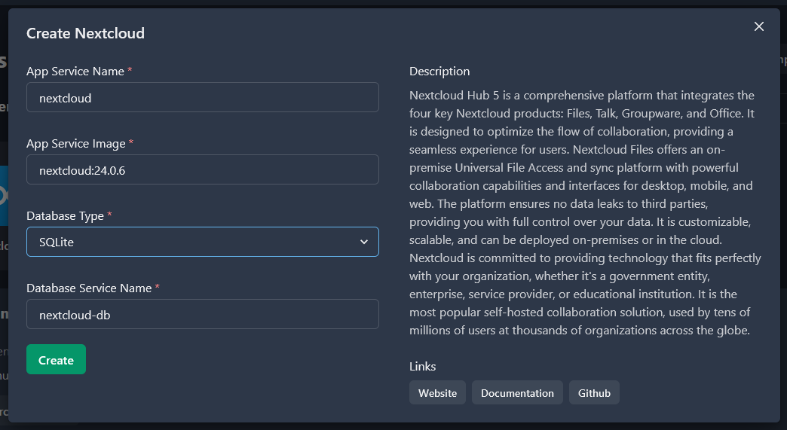
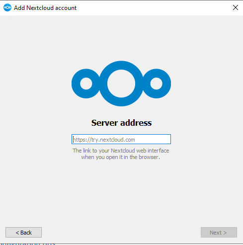

In this tutorial, I will share on hosting Nextcloud in your own VPS. Nextcloud is Google Drive/OneDrive/Dropbox alternative that you can host it in your own server. It has it's own file sync client that is great for daily use.

You will need:

1. VPS with minimum 1vCore 2GB RAM 20gb disk space (minimum for EasyPanel installation). Latest stable Ubuntu Server is preferred (the one that ends with XX.04). You can link S3 external storage later for much bigger disk space.
2. Domain name (optional). Get it at Namecheap or your preferred domain reseller.

Here, I assume you have some knowledge on:

1. Basic Linux/Ubuntu shell operations.
2. DNS configuration

Lets get started.

## Install EasyPanel

We use EasyPanel to ease up our server management process. It's free tier is good enough for hobbyist.

First, log in to your VPS with root or user with sudo permission.

Once logged in, run below command:

```
curl -sSL https://get.easypanel.io | sh
```

Wait for the installation to complete.

After installation complete, Easypanel will show the configured domain name for your machine. The domain should end up with **xxxx.easypanel.host**. You can easily change the domain to your own in EasyPanel's settings > General > Panel Domain.

## Install Nextcloud

Go to Easypanel dashboard via provided link in your terminal.

Register admin account, and then create a new project.

On the newly created project, find Template button. Search and choose "Nextcloud" from the list.

Default settings are good enough. Personally I would do below config.

1. App Service Image: `nextcloud:latest`
2. Database Type: `Postgres`

Click "Create" button.



Wait unil both servers (app and database) up with green color, and you are ready.

Congratulations on your very own self-hosted Nextcloud instance!

## BONUS: Get Nextcloud desktop sync application

You will need the desktop application if you plan to sync your files to your newly created Nextcloud instance.

Head to [Nextcloud](https://nextcloud.com/install/#install-clients) website and under the "Get Nextcloud" button, choose "Desktop & mobile apps". Next, download and install the application.

Remember to insert your Nextcloud instance's URL in the server address field!



Read more:

- [EasyPanel](https://easypanel.io/)
- [NextCloud user manual](https://docs.nextcloud.com/server/latest/user_manual/en/)
- [Configure Nextcloud External Storage](https://www.youtube.com/watch?v=MJjonlQ8CEQ)